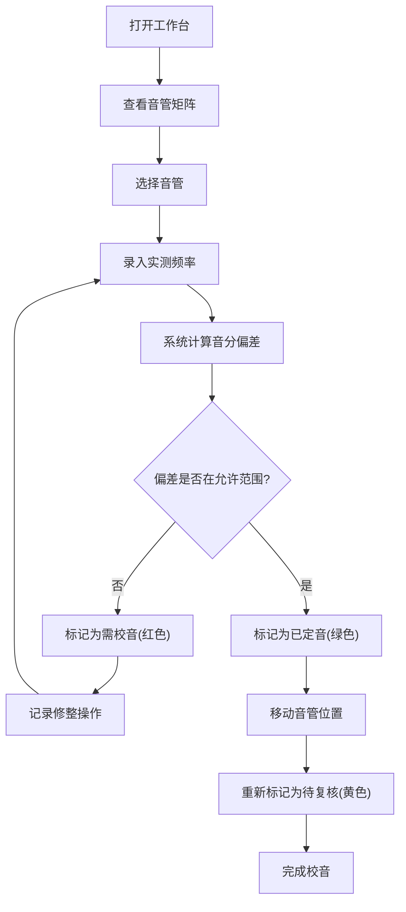

## 1. 产品概述

手摇风琴音管校音工作台是一款专业的制琴工具，帮助手摇风琴制作师按照键位排列音管，并记录每根音管的音高偏差和修整过程。通过直观的可视化界面和精确的音分计算，提高校音效率和质量。

- **目标用户**：手摇风琴制作师、音管调校工匠
- **核心价值**：可视化音管矩阵、精确音分计算、校音过程追踪

## 2. 核心功能

### 2.1 用户角色

| 角色 | 注册方式 | 核心权限 |
|------|----------|----------|
| 制作师 | 本地使用 | 音管管理、数据录入、图表查看 |

### 2.2 功能模块

1. **音管矩阵区**：可拖拽的音管矩阵，展示键位布局，支持音管排序和位置调整
2. **音管详情面板**：录入目标频率和实测频率，显示音分偏差和状态
3. **音域图**：D3.js 绘制的整体音域分布图
4. **偏差对比图**：校音前后偏差对比柱状图
5. **校音记录**：记录每根音管的修整历史和过程

### 2.3 页面详情

| 页面名称 | 模块名称 | 功能描述 |
|----------|----------|----------|
| 工作台主页 | 音管矩阵 | 可拖拽音管卡片，展示键位序号、音名、频率和偏差状态，支持拖拽排序 |
| 工作台主页 | 详情面板 | 选中音管后显示详细信息，可编辑目标频率、实测频率，查看音分偏差 |
| 工作台主页 | 音域图 | D3.js 绘制的钢琴键盘式音域图，标记所有音管的音高位置 |
| 工作台主页 | 偏差对比图 | D3.js 柱状图，对比校音前后的音分偏差 |
| 工作台主页 | 工具栏 | 添加音管、删除音管、允许偏差设置、导出数据 |

## 3. 核心流程

### 3.1 主要用户流程

制作师打开工作台 → 查看音管矩阵布局 → 选择一根音管 → 录入实测频率 → 系统自动计算音分偏差 → 根据颜色判断是否需要继续校音 → 记录修整操作 → 移动音管到正确位置 → 音管标记为待复核 → 完成所有音管校音

## 4. 用户界面设计

### 4.1 设计风格

- **设计方向**：工业精密仪器风格，深色主题，强调专业性和精确感
- **主色调**：深灰蓝色 (#1a2332) 作为背景，营造专业精密氛围
- **强调色**：
  - 正常/已定音：翠绿 (#10b981)
  - 待复核：琥珀黄 (#f59e0b)
  - 需校音/超标：赤红 (#ef4444)
- **字体**：使用 JetBrains Mono 等宽字体展示数值，搭配 Inter 作为界面字体
- **按钮风格**：简约扁平化，细边框，悬停时有微妙发光效果
- **布局风格**：三栏布局，左侧工具栏，中间音管矩阵，右侧详情面板
- **视觉细节**：细微网格背景，卡片式浮起效果，状态颜色呼吸动画

### 4.2 页面设计概述

| 页面名称 | 模块名称 | UI元素 |
|----------|----------|--------|
| 工作台主页 | 音管矩阵 | 网格布局、可拖拽卡片、状态色边框、音名标签、频率数值 |
| 工作台主页 | 详情面板 | 表单输入、偏差仪表盘、状态徽章、历史记录列表 |
| 工作台主页 | 音域图 | 钢琴键盘可视化、音管位置标记、频率刻度 |
| 工作台主页 | 偏差对比图 | 柱状图、前后对比、基准线、颜色编码 |

### 4.3 响应式设计

- 桌面端优先设计（1440px+）
- 支持平板尺寸（1024px）：详情面板折叠为底部抽屉
- 音管矩阵支持滚动浏览

### 4.4 数据可视化

- **音域图**：使用 D3.js 绘制标准钢琴键盘布局，每个音管在对应音高位置标记
- **偏差对比图**：分组柱状图，每根音管显示校音前和校音后的偏差值
- **偏差仪表盘**：半圆形仪表盘，直观显示当前偏差在允许范围内的位置
