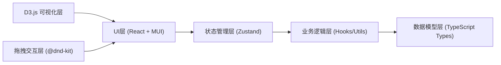
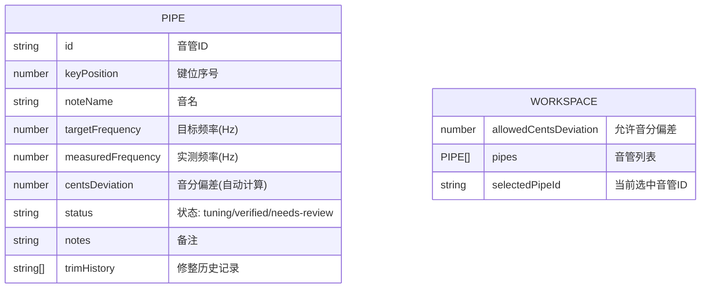

## 1. 架构设计



## 2. 技术描述

- **前端框架**：React 18 + TypeScript 5
- **UI 组件库**：MUI (Material-UI) v5
- **构建工具**：Vite 5
- **状态管理**：Zustand
- **可视化**：D3.js v7
- **拖拽交互**：@dnd-kit/core + @dnd-kit/sortable
- **图标**：@mui/icons-material
- **包管理器**：npm

## 3. 路由定义

| 路由 | 用途 |
|------|------|
| / | 工作台主页 - 音管矩阵、详情面板、音域图、偏差对比图 |

## 4. 数据模型

### 4.1 数据模型定义



### 4.2 类型定义

```typescript
// 音管状态类型
type PipeStatus = 'tuning' | 'verified' | 'needs-review';

// 音管数据模型
interface Pipe {
  id: string;
  keyPosition: number; // 键位序号，1开始
  noteName: string; // 音名，如 "C4", "A4"
  targetFrequency: number; // 目标频率 Hz
  measuredFrequency?: number; // 实测频率 Hz
  centsDeviation?: number; // 音分偏差（自动计算）
  status: PipeStatus;
  notes: string;
  trimHistory: TrimRecord[];
  createdAt: string;
  updatedAt: string;
}

// 修整记录
interface TrimRecord {
  id: string;
  timestamp: string;
  beforeFrequency: number;
  afterFrequency: number;
  description: string;
}

// 工作台状态
interface WorkspaceState {
  pipes: Pipe[];
  selectedPipeId: string | null;
  allowedCentsDeviation: number; // 默认 5 音分
}
```

## 5. 核心算法

### 5.1 音分偏差计算

音分（Cent）是音程的单位，100音分等于一个半音。

公式：
```
cents = 1200 * log2(measuredFrequency / targetFrequency)
```

### 5.2 频率转音名计算

基于 A4 = 440Hz 标准音高，计算频率对应的音名和八度。

## 6. 项目结构

```
src/
├── components/
│   ├── PipeMatrix/          # 音管矩阵组件
│   │   ├── PipeCard.tsx     # 单个音管卡片
│   │   └── index.tsx        # 矩阵容器
│   ├── PipeDetailPanel/     # 音管详情面板
│   │   ├── FrequencyInput.tsx
│   │   ├── CentsGauge.tsx
│   │   ├── TrimHistory.tsx
│   │   └── index.tsx
│   ├── Visualizations/      # D3.js 可视化
│   │   ├── RangeChart.tsx   # 音域图
│   │   └── DeviationChart.tsx # 偏差对比图
│   └── Toolbar/             # 工具栏
│       └── index.tsx
├── hooks/
│   ├── usePipeStore.ts      # Zustand store
│   ├── useDragDrop.ts       # 拖拽逻辑
│   └── useFrequencyCalc.ts  # 频率计算
├── utils/
│   ├── centsCalculator.ts   # 音分计算
│   ├── noteConverter.ts     # 音名转换
│   └── mockData.ts          # 初始mock数据
├── types/
│   └── index.ts             # 类型定义
├── App.tsx
├── main.tsx
└── theme.ts                 # MUI 主题配置
```

## 7. 关键约束实现

1. **同一键位只能放一根音管**：拖拽时检查目标位置是否已有音管，有则交换位置或拒绝放置
2. **频率必须大于零**：输入验证，使用 MUI TextField 的 validation
3. **音分偏差自动计算**：useEffect 监听 targetFrequency 和 measuredFrequency 变化
4. **偏差超标突出显示**：根据 centsDeviation 与 allowedCentsDeviation 比较，应用不同颜色主题
5. **移动后待复核**：拖拽完成后，如果原状态为 verified，自动更新为 needs-review
